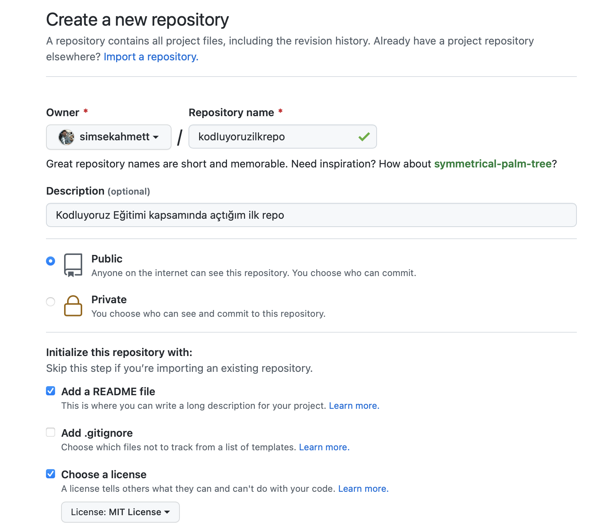

# Kodluyoruz İlk Repo
Bu repo [Kodluyoruz](https://app.patika.dev/moduller/git/odev1) Front-End eğitiminde oluşturdugumuz ilk repo , içerisinde bir adet README dosyası, bir adet index. html barındırıyor.


## Installation
Öncelikle projeyi clonelayın.
```
https://github.com/simsekahmett/kodluyoruzilkrepo.git
```

## Usage
Clonelanan projeyi Visual Studio Code programında açınız.
Linux için;
```
cd kodluyoruzilkrepo
code .
```

## Contributing
Pull requestler kabul edilir. Büyük değişiklikler için, lütfen önce neyi değiştirmek istediğinizi tartışmak için bir konu açınız.

## License
[MIT](https://choosealicense.com/licenses/mit/)